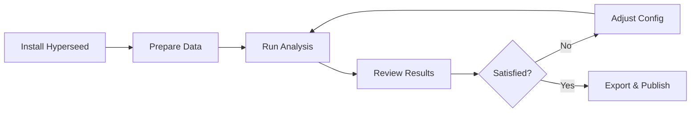

# Getting Started

Welcome to Hyperseed! This section will help you get up and running with hyperspectral seed analysis.

## Overview

Hyperseed provides a complete pipeline for analyzing hyperspectral imagery of plant seeds:

1. **Install** the package via pip or from source
2. **Prepare** your ENVI format hyperspectral data
3. **Configure** analysis parameters (or use defaults)
4. **Analyze** single datasets or batch process multiple datasets
5. **Visualize** results with auto-generated plots

## What You'll Learn

-   :material-download:{ .lg .middle } **[Installation](installation.md)**

    ---

    Install Hyperseed using pip, from GitHub, or from source

-   :material-rocket-launch:{ .lg .middle } **[Quick Start](quick-start.md)**

    ---

    Run your first analysis in 5 minutes

-   :material-cog:{ .lg .middle } **[Configuration](configuration.md)**

    ---

    Customize the analysis pipeline for your needs

## Prerequisites

Before you begin, ensure you have:

- **Python 3.10+** installed on your system
- **8GB+ RAM** available (recommended)
- **Hyperspectral data** in ENVI format with white/dark references

## Typical Workflow

## Need Help?

- **Issues**: Report bugs on [GitHub Issues](https://github.com/nishad/hyperseed/issues)
- **Questions**: Check the [Troubleshooting Guide](../user-guide/troubleshooting.md)
- **Examples**: See [User Guide](../user-guide/index.md) for detailed examples

Ready to begin? Start with [Installation →](installation.md)
