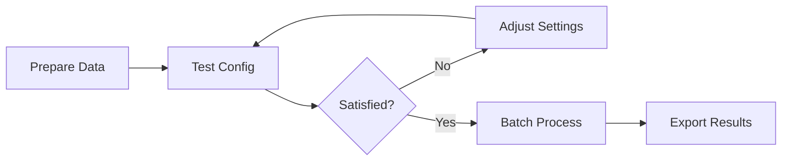

# User Guide

Comprehensive documentation for using Hyperseed's features and workflows.

## Overview

This user guide covers all aspects of hyperspectral seed analysis with Hyperseed, from data preparation to advanced workflows.

## Topics

<div class="grid cards" markdown>

-   :material-folder-open:{ .lg .middle } **[Data Preparation](data-preparation.md)**

    ---

    Learn about expected data structure and ENVI format requirements

-   :material-waveform:{ .lg .middle } **[Preprocessing](preprocessing.md)**

    ---

    Understand spectral preprocessing methods and when to use them

-   :material-grid:{ .lg .middle } **[Segmentation](segmentation.md)**

    ---

    Explore segmentation algorithms and optimize seed detection

-   :material-layers-triple:{ .lg .middle } **[Batch Processing](batch-processing.md)**

    ---

    Process multiple datasets efficiently

-   :material-help-circle:{ .lg .middle } **[Troubleshooting](troubleshooting.md)**

    ---

    Solutions to common issues and error messages

</div>

## Typical Workflows

### Basic Workflow


1. Ensure data is in [correct format](data-preparation.md)
2. Run analysis with `--export-plots`
3. Review segmentation quality
4. Export final results

### Advanced Workflow



1. Prepare data and create [configuration](../getting-started/configuration.md)
2. Test on single dataset
3. Iteratively adjust [preprocessing](preprocessing.md) and [segmentation](segmentation.md)
4. [Batch process](batch-processing.md) all datasets
5. Export and analyze results

## Best Practices

### For Best Segmentation

1. **Use minimal preprocessing** for segmentation
2. **Set appropriate min_pixels** based on seed size
3. **Enable outlier removal** to filter artifacts
4. **Use watershed algorithm** for touching seeds
5. **Always review plots first** before batch processing

### For Spectral Analysis

1. **Apply appropriate preprocessing** (SNV, smoothing, derivatives)
2. **Use calibrated data** (not preprocessed data) for final spectra
3. **Check for bad pixels** in reference images
4. **Validate wavelength calibration** in header files
5. **Document preprocessing steps** for reproducibility

## Common Use Cases

### Use Case 1: Quick Seed Count

```bash
hyperseed analyze dataset/sample_001 \
    --output results.csv \
    --min-pixels 50
```

Result: CSV with seed count and basic morphology

### Use Case 2: Detailed Spectral Analysis

```bash
hyperseed analyze dataset/sample_001 \
    --output results.csv \
    --preprocess advanced \
    --export-plots
```

Result: CSV with preprocessed spectra + visualization plots

### Use Case 3: Production Batch Processing

```bash
hyperseed batch dataset/ \
    --output-dir results/ \
    --config production_config.yaml
```

Result: Consistent analysis across all datasets

## Need More Help?

- **Quick answers**: Check [Troubleshooting](troubleshooting.md)
- **Command details**: See [CLI Reference](../cli-reference/index.md)
- **API usage**: See [API Reference](../api-reference/index.md)
- **Report bugs**: [GitHub Issues](https://github.com/nishad/hyperseed/issues)
